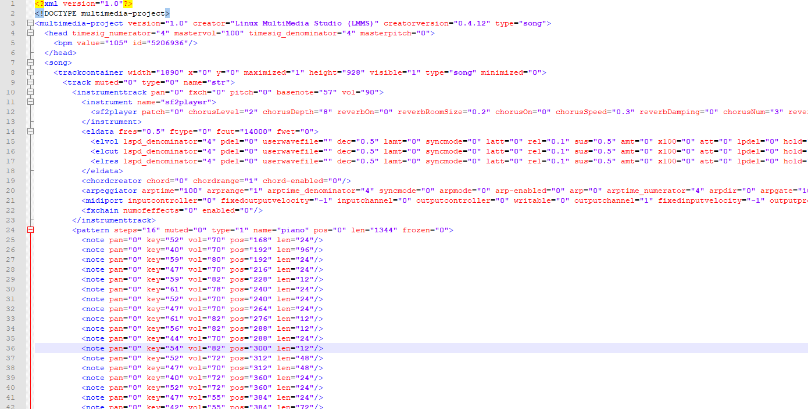

## 🎶.mmp to MusicXML 🎶    
Currently a basic script that attempts to convert .mmp files (which are XML files! :D) to MusicXML files so that you can import them to MuseScore!    
Still probably buggy, but the idea is to help provide significant time savings in getting your music from LMMS to sheets. :)    
Made using Python 3.7.2.
    
### USAGE:    
`python main.py [file path to an .mmp file]`    
    
The output will be named whatever the file's name is as an xml file in the same directory. You can then use MuseScore to view it. I've not tested with other notation software.    
    
some things to note as of now:    
- the smallest note type the script can understand is a 64th note, so anything smaller will break things 
- no tied and/or dotted notes
- can't identify intended triplets
- I've specified some instruments for the program to identify based on the track names - i.e. flute, piano, clarinet since I work with a lot of those instrument soundfonts. I should extend this to accept TripleOscillator tracks, for example, though as well.    
    
You can try out the script with the included test .mmp files, or check out some of my results in /example_output!    
    
Turn this:    
    
    
which is actually something like this:    
    
    
into this:    
    

