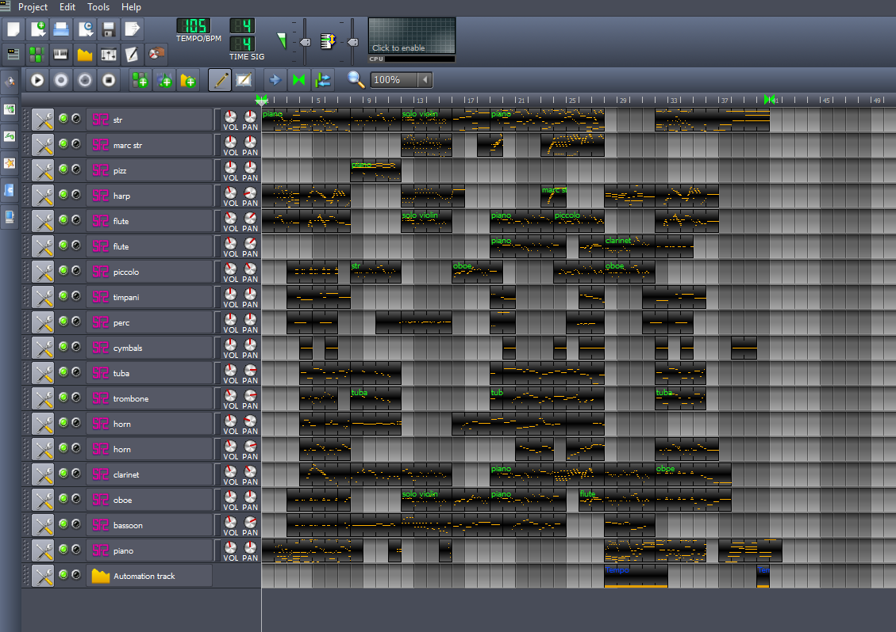
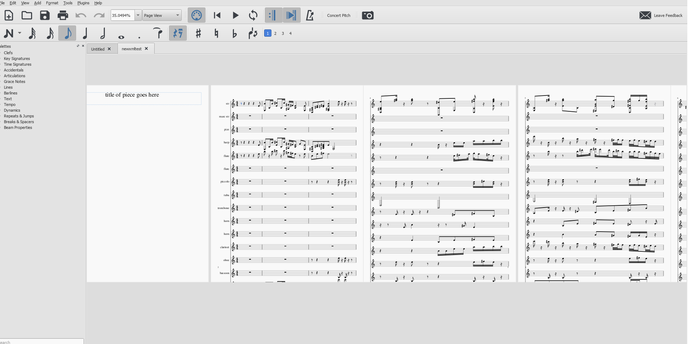

## .mmp to MusicXML    
currently an extremely basic script that attempts to convert .mmp files to MusicXML files so that you can import them to MuseScore!    
still a bit buggy and sometimes a 'corrupted' file may be produced, but still works in MuseScore.     
    
some things to note:    
- the smallest note type the script can understand is a 64th note, so anything smaller will break things 
- can't handle triplets 
- can't handle time signatures other than 4/4
- I've specified some instruments for the program to identify based on the track names - i.e. flute, piano, clarinet since I work with a lot of those instrument soundfonts. I should extend this to accept TripleOscillator tracks, for example, though as well.    
    
You can try out the script with the included test .mmp files!    
    
Turn this:    
    
    
into this:    
    

